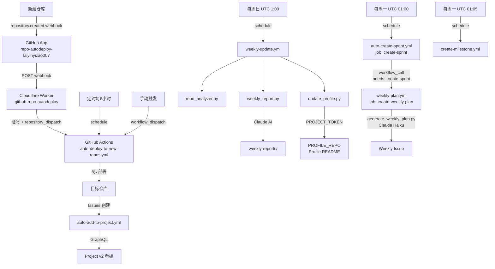
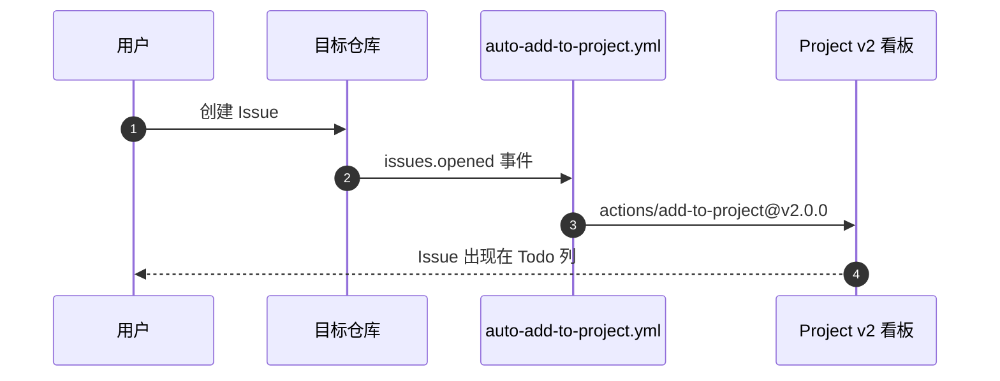
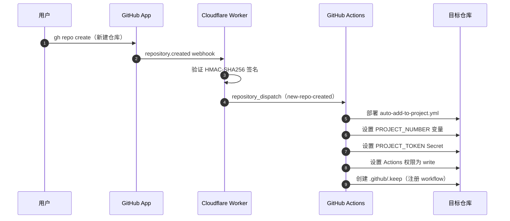
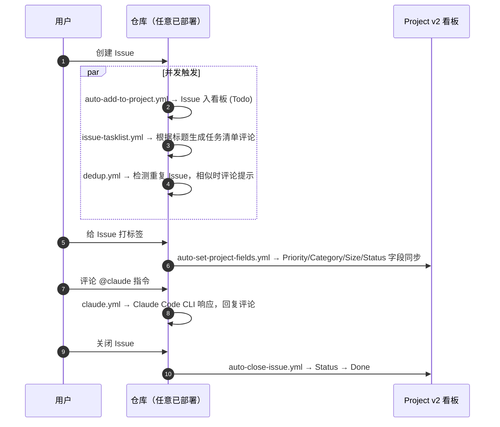
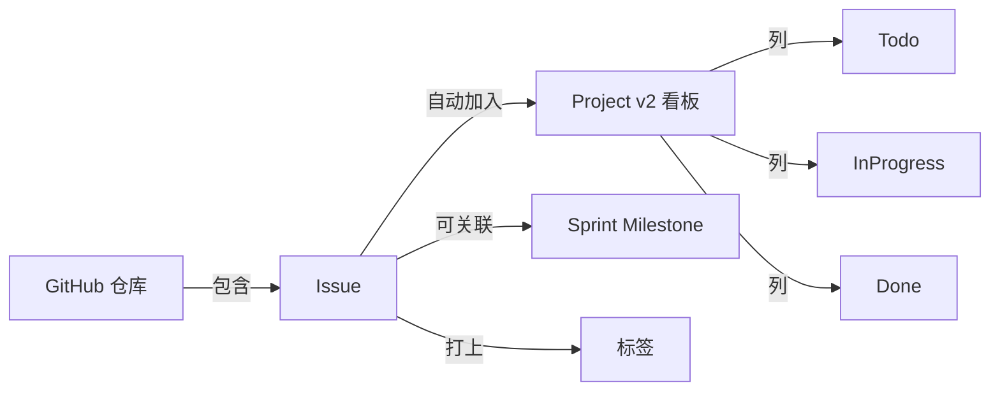
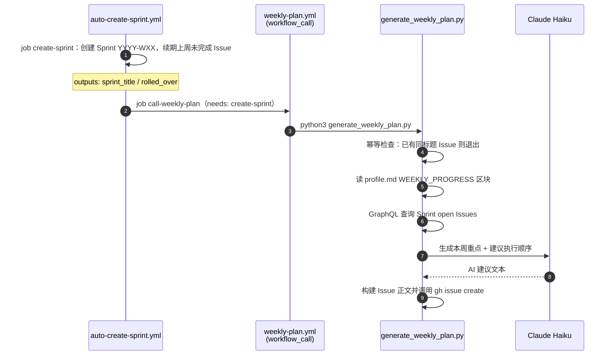

# PROJECTWIKI.md

## 1. 项目概述

- **目标**：基于 GitHub Issues + Projects 构建综合个人管理系统，包含任务看板管理、Sprint 自动化、AI 周报生成、GitHub Profile 自动更新及仓库质量分析。
- **背景**：个人账号无法使用 Organization 级功能，通过 GitHub App + Cloudflare Worker + GitHub Actions 三层架构实现等效的全自动化。原 `github-weekly-progress` 仓库已于 2026-09-11 合并至本仓库。
- **范围**：个人 GitHub 账号（`laiyinyizao007`）下的所有私有/公开仓库，以及 `laiyinyizao007/laiyinyizao007` Profile README 的自动同步。
- **运行环境**：GitHub Actions（ubuntu-latest）、Cloudflare Workers（免费套餐）、Claude AI（Haiku 模型）。

---

## 2. 架构设计

### 总体架构

### Issue 自动入看板流程

### 新仓库自动接入流程

### Issue 创建完整自动化流程

---

## 3. 架构决策记录（ADR）

### ADR-004：用 `workflow_call` 替代 `repository_dispatch` 驱动周计划生成

- **背景**：原设计中 `weekly-plan.yml` 同时有 `schedule` 和 `repository_dispatch` 两个触发器，每周一两者在同一 cron 点（`0 1 * * 1`）几乎同时启动，存在重复创建 Issue 的竞态风险；且 dispatch 使用 `if: always()` 会在 Sprint 创建失败时仍然触发。
- **决策**：将 `weekly-plan.yml` 改为 `workflow_call` 目标，由 `auto-create-sprint.yml` 通过 job dependency（`needs: create-sprint`）显式调用，移除 `schedule` 和 `repository_dispatch` 触发器。
- **替代方案**：保留 `schedule`，通过幂等检查防止重复创建（已有，但不能防止两次并发都通过检查）。
- **影响**：消除双触发竞态；job 依赖自动保证 Sprint 成功后才调用 weekly-plan；GitHub Actions UI 可视化展示调用图；数据通过 typed inputs 传递，无需额外 API 调用；`if: always()` smell 被移除。

### ADR-001：使用 PAT 而非 GITHUB_TOKEN 操作 Project v2

- **背景**：私有仓库的 `GITHUB_TOKEN` 默认无 `projects: write` 权限，调用 Project v2 GraphQL API 时返回 403。
- **决策**：使用 classic PAT（`repo + project` scope）作为 `PROJECT_TOKEN` Secret。
- **影响**：每个目标仓库都需要存储该 Secret，通过自动化脚本/workflow 传播。

### ADR-002：GitHub App + Cloudflare Worker 实现实时新仓库感知

- **背景**：个人账号无组织级 webhook，无法在账号层面监听 `repository.created` 事件。
- **决策**：注册 GitHub App 订阅 `Repositories` 事件，webhook 指向 Cloudflare Worker，Worker 触发 `repository_dispatch`。
- **替代方案**：定时扫描（每 6 小时，已作为兜底保留）。
- **影响**：新仓库创建后实时（秒级）自动完成接入，无需人工操作。

### ADR-003：Worker 只做中继，部署逻辑保留在 GitHub Actions

- **背景**：Cloudflare Workers 不原生支持 libsodium，无法直接加密 GitHub Secrets；且 `gh` CLI 已封装所有复杂操作。
- **决策**：Worker 仅负责 webhook 验签 + 触发 `repository_dispatch`，实际部署由 GitHub Actions 完成。
- **影响**：架构更清晰，维护成本低。

---

## 4. 设计决策 & 技术债务

| 项目 | 说明 | 优先级 |
|------|------|--------|
| PAT 轮换 | PROJECT_TOKEN 过期后需手动更新各仓库 Secret | 低 |
| Worker 错误告警 | 当前 Worker 失败仅记录日志，无通知机制 | 低 |
| 多 Project 支持 | 目前 PROJECT_NUMBER 默认为 1，不支持多看板（可通过参数覆盖） | 低 |
| deploy 排除列表 | 管理仓库专用 workflow 需手动加入两处排除列表（yaml + PS 脚本）；新增可部署 workflow 无需修改任何列表 | 低 |
| CLAUDE.md 分发 | `CLAUDE.md` 目前仅在管理仓库，不自动推送到目标仓库；如需目标仓库也有 Claude 指令，需扩展 auto-deploy 逻辑 | 低 |
| ~~`generate_weekly_plan.py` God Script~~ | ~~1315 行，6+ 模式（v1.17 已部分优化：脚本提取、`tempfile`、并发）~~ 已完成拆分：脚本提取、`tempfile`、并发拉取；剩余 God Script 整体拆分（按 CLI flag 拆分为多文件）暂缓 | 低 |
| ~~dedup token 暴露~~ | ~~`GITHUB_TOKEN` 与 issue title 作为 CLI 参数暴露（v1.17 已修：改用 env var 注入）~~ | 已完成（v1.17） |
| ~~`run_gh` 错误静默~~ | ~~失败时调用方仅见 `None`，CI 调试困难（v1.17 已修：打印 stderr 前 200 字符）~~ | 已完成（v1.17） |

---

## 5. 模块文档

### 5.1 auto-add-to-project.yml

- **路径**：`.github/workflows/auto-add-to-project.yml`
- **触发**：`issues: [opened, reopened, transferred]`、`workflow_dispatch`
- **功能**：将 Issue 自动加入 `PROJECT_NUMBER` 对应的 Project v2 看板
- **依赖**：`secrets.PROJECT_TOKEN`（PAT）、`vars.PROJECT_NUMBER`、`vars.PROJECT_OWNER_TYPE`（可选，默认 `users`）
- **Org 兼容**：project-url 通过 `PROJECT_OWNER_TYPE` 变量控制路径前缀（`users` / `orgs`），默认为个人账号

### 5.2 auto-deploy-to-new-repos.yml

- **路径**：`.github/workflows/auto-deploy-to-new-repos.yml`
- **触发**：`repository_dispatch[new-repo-created]`、`schedule(每6小时)`、`workflow_dispatch`
- **功能**：向目标仓库完成 5 步部署（workflow + 变量 + Secret + 权限 + 注册）
- **WF 列表**：动态枚举源仓库 `.github/workflows/` 下所有文件，过滤排除列表（管理仓库专用项）；新增可部署 workflow 无需修改此文件
- **排除列表**：`auto-deploy-to-new-repos.yml`、`auto-create-sprint.yml`、`weekly-plan.yml`、`create-milestone.yml`、`sync-labels.yml`、`weekly-update.yml`
- **Secret 传播**：部署时自动写入 `PROJECT_TOKEN`；若管理仓库配置了 `ANTHROPIC_API_KEY` / `ANTHROPIC_BASE_URL`，也一并传播到目标仓库
- **依赖**：`secrets.PROJECT_TOKEN`（PAT，同时用于传播自身）、`secrets.ANTHROPIC_API_KEY`（可选）

### 5.3 weekly-plan.yml

- **路径**：`.github/workflows/weekly-plan.yml`（仅管理仓库）
- **触发**：
  - `workflow_call`（主路径）：由 `auto-create-sprint.yml` 的 `call-weekly-plan` job 调用，inputs: `sprint_title` / `rolled_over`
  - `workflow_dispatch`（兜底）：手动触发，相同 inputs 供临时运行
- **功能**：运行 `generate_weekly_plan.py`，自动创建 `[Weekly] YYYY-WXX` Issue（含 AI 建议 + 续期任务 + 每日回顾模板）
- **幂等性**：Python 脚本检查 `type: weekly-plan` label 下已有同标题 Issue，重复则跳过
- **依赖**：`secrets.ANTHROPIC_API_KEY`、`secrets.PROJECT_TOKEN`、`vars.PROJECT_NUMBER`
- **注意**：不再有独立 schedule 触发；每周一唯一入口为 `auto-create-sprint.yml`（见 ADR-004）

### 5.4 create-milestone.yml

- **路径**：`.github/workflows/create-milestone.yml`（仅管理仓库）
- **触发**：每周一 UTC 01:05（北京时间 09:05），错峰 5 分钟，避免与 `auto-create-sprint.yml`（01:00）拥塞
- **功能**：自动创建 `Sprint YYYY-WXX` Milestone，due_on 设为当周周五 23:59:59 UTC；已存在则跳过（幂等）

### 5.5 sync-labels.yml

- **路径**：`.github/workflows/sync-labels.yml`
- **触发**：push 到 main、`workflow_dispatch`
- **功能**：从 `.github/labels.yml` 同步标签到仓库

### 5.6 Cloudflare Worker

- **名称**：`github-repo-autodeploy`
- **URL**：`https://github-repo-autodeploy.lovablelife.workers.dev`
- **代码**：`cloudflare-worker/src/index.js`
- **Secrets**：`WEBHOOK_SECRET`、`PAT`、`SOURCE_REPO`
- **功能**：验证 GitHub App webhook 签名，触发 `repository_dispatch`

### 5.8 auto-set-project-fields.yml

- **路径**：`.github/workflows/auto-set-project-fields.yml`
- **触发**：`issues: [labeled]`
- **功能**：给 Issue 打标签时，自动同步 Project 字段值
- **映射关系**：
  - `priority: P0/P1/P2/P3` → Priority 字段
  - `task/bug/feature/research/epic` → Category 字段
  - `size: XS/S/M/L/XL` → Size 字段
  - `status: todo/in-progress/blocked/review/done` → Status 字段
- **竞态处理**：Issue 开启时 `auto-add-to-project` 与本 workflow 同时触发，Issue 可能尚未进入 Project；3 次指数退避重试（2s→4s→8s），仍失败则 `core.warning` + Step Summary
- **API 韧性**：`graphqlWithRetry` 辅助函数，指数退避重试（1s→2s），401/403 不重试；成功/失败均写 Step Summary
- **Org 兼容**：GraphQL 查询改用 `repositoryOwner(login:)` with inline fragments，同时支持个人账号和 Org 账号
- **依赖**：`secrets.PROJECT_TOKEN`、`vars.PROJECT_NUMBER`

### 5.9 setup-project-board.ps1

- **路径**：`scripts/setup-project-board.ps1`
- **用途**：一次性配置 Project v2 看板（字段 + 视图），通过 GraphQL API 执行
- **用法**：`pwsh scripts/setup-project-board.ps1`
- **创建内容**：Priority / Category / Size / Sprint 字段，Table / Sprint / By Project 视图

### 5.10 auto-create-sprint.yml

- **路径**：`.github/workflows/auto-create-sprint.yml`（仅管理仓库）
- **触发**：每周一 UTC 01:00（北京时间 09:00）、`workflow_dispatch`（周计划流程的唯一 cron 入口）
- **功能**：两个 job 串联执行：
  1. `create-sprint`：创建本周 Sprint 迭代（格式 `Sprint YYYY-WNN`），将上一 Sprint 未关闭 Issue 续期，输出 `sprint_title` / `rolled_over`
  2. `call-weekly-plan`：`needs: create-sprint`，通过 `workflow_call` 调用 `weekly-plan.yml`，传递 inputs；create-sprint 失败则自动跳过
- **GraphQL 兼容性**：使用 `repositoryOwner(login:)` + inline fragments（`... on User` / `... on Organization`），同时兼容个人账号和 Org 账号（ADR-004 修复点）
- **去重**：基于 `startDate` 判断，若本周已有迭代则跳过（幂等），`call-weekly-plan` job 仍继续执行
- **依赖**：`secrets.PROJECT_TOKEN`、`vars.PROJECT_NUMBER`

### 5.11 scripts/common.ps1

- **路径**：`scripts/common.ps1`
- **用途**：PowerShell 共享函数库，供其他脚本通过 `. "$PSScriptRoot/common.ps1"` 引入
- **提供**：
  - `Get-ProjectToken`：统一的 PAT 获取逻辑（优先读 `$env:GH_TOKEN`，否则安全提示输入）
  - `Remove-ProjectToken`：会话结束时清理临时环境变量
  - `Get-CurrentRepo`：动态获取当前仓库 `Owner`/`Name`/`Full`（消除硬编码）

### 5.12 claude.yml

- **路径**：`.github/workflows/claude.yml`
- **触发**：`issue_comment[created]`（评论含 `@claude`）、`issues[opened]`（标题或正文含 `@claude`）、`workflow_dispatch`
- **条件**：`github.actor == github.repository_owner`（仅限仓库 Owner，防外部触发）
- **功能**：
  - 提取 Issue/评论中的 prompt，调用 `claude --print` 运行 Claude Code CLI，将结果以评论形式发布到原 Issue
  - **对话历史**：评论触发时，自动拉取 Issue 正文及所有历史评论并构造上下文，Claude 可进行多轮连续对话
  - **并发控制**：`concurrency` 组 `claude-<issue_number>`，同一 Issue 的多次触发串行执行（`cancel-in-progress: false`）
  - **写权限模式**：`--permission-mode acceptEdits` + `--allowedTools` 使 Claude 可在 Action 中读写文件、创建 PR；Owner 门禁保证安全
- **npm 缓存**（v1.17+）：`actions/cache@v4` 显式缓存 `~/.npm`，key `npm-claude-code-${{ runner.os }}`；原 `setup-node cache: 'npm'` 因仓库无 `package-lock.json` 静默失效，现已移除
- **依赖**：`secrets.ANTHROPIC_API_KEY`（必填）、`secrets.ANTHROPIC_BASE_URL`（可选）
- **已部署**：通过 `auto-deploy-to-new-repos.yml` 自动部署到所有目标仓库

### 5.13 CLAUDE.md

- **路径**：`CLAUDE.md`（根目录）
- **用途**：Claude Code 在各仓库中的行为规范文档（仅供 Claude 读取，不影响 workflow 执行）
- **内容**：角色定义（仅限 `@claude` 触发）、响应语言策略（与 Issue 语言一致）、工作边界（不修改 workflow、代码变更走 PR）
- **注意**：此文件**不通过 auto-deploy 推送**到目标仓库，属于本管理仓库的全局指令

### 5.14 issue-tasklist.yml

- **路径**：`.github/workflows/issue-tasklist.yml`、`.github/scripts/generate_tasklist.py`
- **触发**：`issues: [opened]`
- **条件**：Issue 正文无既有 `- [ ]` 且标题非空
- **功能**：根据 Issue 标题前缀（Conventional Commits 风格）自动生成 Task List 评论
  - 规则分组：fix / feat / refactor / improve / docs / test / ci / chore + 通用兜底
  - 标题含 scope（如 `feat(api):`）时自动剥离后再匹配
  - 标题长度 ≤ 10 字符时跳过
- **脚本提取**（v1.17+）：原内联 161 行 Python heredoc 提取为 `.github/scripts/generate_tasklist.py`，与 `dedup.py` 风格一致，可独立运行/测试；workflow 通过 `sparse-checkout: .github/scripts` 仅拉取脚本目录
- **API 韧性**：`api_request()` 函数，timeout=30，指数退避重试（1s→2s→4s），错误分类（401/403/404/422 不重试；429 读 `Retry-After`；网络错误重试）；POST 失败 fallback 打印 body 到日志，`exit 0` 不阻断 Issue 流程
- **依赖**：`secrets.GITHUB_TOKEN`（内置，无需额外配置）
- **已部署**：通过 `auto-deploy-to-new-repos.yml` 自动部署到所有目标仓库

### 5.15 dedup.yml / scripts/dedup.py

- **路径**：`.github/workflows/dedup.yml`、`.github/scripts/dedup.py`
- **触发**：`issues: [opened]`
- **功能**：检测新 Issue 是否与已有 Issue 重复，相似时自动评论提示
  - 算法：Jaccard 相似度 + SequenceMatcher 取最大值，阈值 0.6
  - Conventional Commits 前缀剥离后再比较，避免前缀干扰
  - 有效词少于 2 个时自动跳过（短标题误报率高）
  - 最多列出 5 条相似 Issue，按相似度倒序排列
- **API 韧性**：`api_request()` 函数，timeout=30，指数退避重试（1s→2s→4s），错误分类（401/403/404 不重试；429 读 Retry-After；5xx + 网络错误重试）；单页失败时降级运行；评论失败时 fallback 打印到日志，exit 0 不阻断 Issue 流程
- **输入注入**（v1.17+）：Workflow 通过 `env:` 注入 `ISSUE_NUMBER` / `ISSUE_TITLE` / `REPO` / `GH_TOKEN`，脚本改用 `os.environ.get()` 读取；消除 token 在进程列表/workflow 日志的暴露，消除特殊字符 title 的 shell 注入风险
- **依赖**：`secrets.GITHUB_TOKEN`（内置，无需额外配置）
- **已部署**：通过 `auto-deploy-to-new-repos.yml` 自动部署到所有目标仓库

### 5.16 weekly-update.yml

- **路径**：`.github/workflows/weekly-update.yml`（仅管理仓库，不部署到目标仓库）
- **触发**：每周日 UTC 01:00（北京时间 09:00）、`workflow_dispatch`
- **功能**：依次运行三个 Python 脚本，完成仓库分析 → Profile 更新 → 周报生成，最终同步 Profile README 到目标 Profile 仓库
- **目标仓库**：`${{ vars.PROFILE_REPO || format('{0}/{0}', github.repository_owner) }}`（可通过仓库变量覆盖，默认 `owner/owner`）
- **依赖**：`secrets.ANTHROPIC_API_KEY`、`secrets.PROJECT_TOKEN`（用于跨仓库写 Profile README）

### 5.17 repo_analyzer.py

- **路径**：`repo_analyzer.py`（根目录）
- **功能**：获取账号下全量仓库（最多 200 个），按 stars / README / description / in_profile 四维度评分（满分 60），更新 `tracked_config.json` 和 `repo_database.md`，支持生成 README 草稿
- **评分规则**：stars 0-20、README 0-15、description 0-10、in_profile 0-15；≥40 自动加入追踪、≤25 自动移除
- **缓存**：`repo_cache.json`（基于 `pushedAt` 增量检测 README，不纳入版本控制）
- **CLI**：`--dry-run`、`--skip-readme-gen`、`--no-auto-update`、`--output DIR`

### 5.18 update_profile.py

- **路径**：`update_profile.py`（根目录）
- **功能**：读取 `tracked_config.json`，更新 `profile.md` 的 `GITHUB_PROJECTS_START/END` 区块，生成项目卡片列表
- **CLI**：`--no-push`（仅本地更新，不同步到远程）

### 5.19 weekly_report.py

- **路径**：`weekly_report.py`（根目录）
- **功能**：读取各追踪仓库近期提交，调用 Claude Haiku（`claude-haiku-4-5-20251001`）生成中文周报，写入 `weekly-reports/YYYY-WXX.md`，同时更新 `profile.md` 的 `WEEKLY_PROGRESS_START/END` 区块
- **CLI**：`--no-push`、`--dry-run`

### 5.24 generate_weekly_plan.py

- **路径**：`generate_weekly_plan.py`（根目录）
- **功能**：由 `weekly-plan.yml` 调用，全自动生成并创建每周计划 Issue
- **执行步骤**：
  1. 计算本周 ISO 8601 周号 + 日期范围（处理跨年边界）
  2. 幂等检查：搜索 `type: weekly-plan` label 下同标题 Issue，已存在则退出
  3. 读取 `profile.md` 的 `WEEKLY_PROGRESS_START/END` 区块作为上周进展
  4. GraphQL 查询 Project v2 当前 Sprint 的 open Issues（分页，最多 100 条/页）；失败时降级为 `gh issue list --state open`
  5. 调用 Claude Haiku（`claude-haiku-4-5-20251001`）生成本周重点 + 建议执行顺序；无 ANTHROPIC_API_KEY 时跳过
  6. 构建 Issue 正文（AI 建议 + 上周进展 + 续期任务 checklist + 每日回顾 + 周回顾），via `gh issue create`
- **环境变量**：`GH_TOKEN`（PROJECT_TOKEN）、`ANTHROPIC_API_KEY`（可选）、`PROJECT_NUMBER`、`SPRINT_TITLE`（由 inputs 传入）、`ROLLED_OVER`、`GH_OWNER`（`${{ github.repository_owner }}`）
- **用户名解析**：`os.environ.get("GH_OWNER") or os.environ.get("GITHUB_REPOSITORY_OWNER") or "laiyinyizao007"`（硬编码作最后 fallback）
- **临时文件**（v1.17+）：`create_issue()` 改用 `tempfile.NamedTemporaryFile(delete=False)` 写入 Issue body；并发运行（schedule 与 workflow_dispatch 同时触发）时路径唯一，`try/finally` 中 `os.unlink` 清理；消除 `/tmp/weekly_plan_body.md` 硬编码路径的并发覆盖竞态
- **错误可观测性**（v1.17+）：`run_gh()` 失败时打印 stderr 前 200 字符（`[gh error] <args>: <stderr>`），调用方可定位失败原因；原行为：静默返回 `None`
- **并发拉取**（v1.17+）：`get_today_commits_by_repo()` 与 `generate_weekly_ai_review()` 改用 `concurrent.futures.ThreadPoolExecutor(max_workers=8)` 并发 60+ 仓库的 `subprocess.run`；预计每次节省 60-120s
- **本地 .env 自动加载**（v1.17+）：脚本启动时 `load_dotenv(BASE_DIR / ".env", override=False)`，本地运行无需手动 export；CI 中无副作用（依赖 `python-dotenv`，已存在）
- **LLM 主备 fallback**（v1.17+）：`_call_with_fallback(messages, *, max_tokens)` 包装层；主 client（`_claude_call` 4 次重试）任何 anthropic 异常 → fallback client（同 4 次重试）；fallback 成功不回退主 client；fallback 失败 → `RuntimeError`
  - 主 client 配置：`LLM_PRIMARY_*` → `ANTHROPIC_*` 回退；model 默认 `claude-haiku-4-5-20251001`
  - fallback 配置：`LLM_FALLBACK_*`（仅新增），model 默认 `MiniMax-M3`
  - 未设 `LLM_FALLBACK_API_KEY` 时行为完全等价于现状
- **5 个 Claude 调用点**（v1.17+）：全部改为 `_call_with_fallback(messages=..., max_tokens=N)`，签名零改动，model 名由包装层管理
- **Daily Review 质量修复**（v1.18+，`daily-review.yml`）：`_call_with_fallback` 失败时打印 `_log_primary_failure_hint` 启发式诊断（覆盖 Relay/401/429 三类错误）
- **输入侧文件列表**（v1.18+）：`_fetch_commits` 从 `commit.message | split("\n")[0]` 升级为 `{msg, files[]}`；新增 `data["files"]` 字段保序去重最多 30 个文件名；LLM 摘要可具体到文件名（如 `docs/X.md`、`babel.config.js`）
- **prompt 双段前缀**（v1.18+）：`generate_daily_ai_review` 改为 `[系统约束]/[用户内容]` 双段；fallback (MiniMax-M3 等非 Anthropic 模型) 也能遵循格式约束；输出强制 `- **仓库名**：动作1；动作2`
- **活跃仓库分母**（v1.18+）：摘要末尾追加 `- 今日活跃 {n} / {N} 个仓库`；`get_today_commits_by_repo()` 返回值签名升级为 `(results, total_count)` 元组；让"漏仓库"主诉可观测化
- **schedule 延迟容差**（v1.18+）：`main()` 入口对 `GITHUB_EVENT_NAME=schedule` 的 daily review 加 4 小时延迟容差，延迟过大时跳过避免污染次日凌晨 Issue 区块；`workflow_dispatch` 手动触发不受限
- **sections 三分类重写**（v1.18.1+，commit `9bbbe11`）：`generate_daily_ai_review` 的 sections 构造从"二分（有无独有）"改为"三分（`batch_only` / `mixed` / `unique_only`）"，彻底修复 60+ 仓库场景下的两个边界 bug：
  1. **共有真正抽取**：sections 顶部单独抽出"【今日批量同步】共有 N 项操作"块，而非平铺到每个仓库的"另同步"附注；混合仓库（`mixed`）的独有工作完整列出但不重复批量部分
  2. **独有不截断**：移除原 `unique[:8]` 上限，任何仓库独有 commit 一条不漏；仅做批量同步的仓库（`batch_only`）聚合到末尾"另有 N 个仓库仅执行批量同步：…"
- **LLM 格式约束 7/8/9 条**（v1.18.1+，commit `8ab655a`）：`system_rules` 追加三条面向三分类 sections 的格式规则：看到【今日批量同步】→ 合并为单行 `- **批量同步（X 仓库）**：操作1；操作2`；看到【xxx 独有工作（另有批量同步）】→ 只输出独有；看到【xxx 独有工作】→ 完整输出独有；确保 fallback LLM (MiniMax-M3) 也能正确格式化
- **执行日志补全**（v1.18.2+）：在关键路径加 `[INFO]`/`[WARN]` 前缀日志，覆盖以下盲区：
  - `main()` daily review 块入口：打印当前北京时间 + 今日 UTC 数据起点（定位凌晨触发 / 数据窗口偏移）
  - `get_today_commits_by_repo()`：打印 since_iso、仓库池大小（追踪 + 新发现）、扫描完成汇总
  - `_fetch_commits()`：gh api 非零返回 → `[WARN]` + stderr 前 120 字符；JSON 解析失败 → `[WARN]` + 异常内容（原先静默 `pass`）
  - `_get_today_push_repos()`：打印 Events API 总条数、今日条数、新发现仓库数
  - `generate_daily_ai_review()`：打印 sections 分类统计 + 字符数（LLM 输入），以及 LLM 响应字符数 + 摘要行数
  - `backfill_missing_issues()`：打印入口"扫描 N 个活跃仓库"
- **GraphQL Owner 兼容**（v1.16.0）：首个 GraphQL 查询改用 `repositoryOwner(login:)` + `... on User` / `... on Organization` inline fragments，同时支持个人账号和 Org 账号（原 `user(login:)` 在 Org owner 下静默返回 null）；解析路径对应改为 `data["data"]["repositoryOwner"]["projectV2"]`
- **GraphQL 分页 cursor**（v1.16.0）：分页不再将 cursor 值字符串拼入 query 默认值，改为通过 `-f cursor=<value>` 参数传递；`$cursor: String`（nullable）变量无需传入时自然解析为 `null`，效果等同于 `after: null` = 从头分页；分页解析异常从静默 break 改为打印 `[warn]` 日志后 break

### 5.7 install-to-repo.ps1

- **路径**：`scripts/install-to-repo.ps1`
- **用途**：手动将 workflow 部署到指定仓库（备用方案，正常由 Worker 自动触发）
- **用法**：`pwsh scripts/install-to-repo.ps1 -TargetRepo "owner/repo" [-AnthropicApiKey "sk-ant-..."] [-AnthropicBaseUrl "..."]`
- **参数**：`-AnthropicApiKey` / `-AnthropicBaseUrl`（可选）——传入后自动调用 `gh secret set` 写入目标仓库

### 5.20 auto-close-issue.yml

- **路径**：`.github/workflows/auto-close-issue.yml`
- **触发**：`issues: [closed]`
- **功能**：Issue 关闭时，通过 GraphQL 将 Project v2 看板中对应 item 的 Status 字段设为 Done
- **特性**：指数退避重试；Issue 不在看板时静默跳过，不报错
- **依赖**：`secrets.PROJECT_TOKEN`、`vars.PROJECT_NUMBER`
- **已部署**：通过 `auto-deploy-to-new-repos.yml` 自动部署到所有目标仓库

### 5.21 tools/github-profile-manager/

- **路径**：`tools/github-profile-manager/`
- **功能**：使用 Claude AI（`claude-sonnet-4-6`）批量为名下仓库生成/更新描述
- **触发**：每周一 UTC 02:00（北京时间 10:00），或手动 `workflow_dispatch`
- **workflow**：`tools/github-profile-manager/.github/workflows/update-descriptions.yml`
- **脚本**：`update_descriptions.py`
- **配置**：`skip_repos.txt`（跳过列表），`.env.example`（密钥模板）
- **依赖**：`secrets.GITHUB_PAT`、`secrets.ANTHROPIC_API_KEY`

### 5.22 tools/mygithubprojectagent/

- **路径**：`tools/mygithubprojectagent/`
- **功能**：基于 RAG 的 GitHub 仓库知识库 Agent 工具，支持本地知识库构建与查询
- **模块**：`chunker` / `embedder` / `knowledge_base` / `rag_engine` / `retriever` / `sanitizer` / `report_generator`
- **文档**：`tools/mygithubprojectagent/docs/PROJECTWIKI.md`
- **安装**：`pip install -r requirements.txt`

### 5.23 scripts/refresh-portfolio.sh

- **路径**：`scripts/refresh-portfolio.sh`
- **功能**：在本地（如树莓派）运行与 `weekly-update.yml` 等效的完整周报流水线
- **用途**：绕过 `GITHUB_TOKEN` 无法跨仓库读取私有仓库 commits 的限制，使用本地 gh CLI PAT
- **CLI**：`--dry-run`、`--push`、`--no-push`（默认不推送）
- **依赖**：gh CLI 已登录、python3、`ANTHROPIC_API_KEY` 环境变量

---

## 6. API 手册

### GitHub Actions Secrets（管理仓库 projectmanagement）

| Secret 名 | 说明 | 用途 |
|-----------|------|------|
| `PROJECT_TOKEN` | classic PAT，scope: `repo + project` | 部署 workflow、写 Profile README（weekly-update.yml 复用） |
| `ANTHROPIC_API_KEY` | Claude API 密钥 | `claude.yml` + `weekly_report.py` |
| `LLM_FALLBACK_API_KEY` | 备用 LLM key（Anthropic 兼容中转服务） | 主 key 限流 / 失败时自动切换；未设则无 fallback |
| `LLM_FALLBACK_BASE_URL` | 备用 LLM 端点（如 `https://your-relay.com`） | 同上 |

### GitHub Actions Secrets（每个目标仓库）

| Secret 名 | 说明 | 来源 |
|-----------|------|------|
| `PROJECT_TOKEN` | classic PAT，scope: `repo + project` | 自动传播（auto-deploy workflow） |
| `ANTHROPIC_API_KEY` | Claude API 密钥，供 `claude.yml` 调用 Claude Code CLI | 自动传播（管理仓库有配置时）|
| `ANTHROPIC_BASE_URL` | 可选，自定义 Claude API 端点 | 自动传播（管理仓库有配置时）|
| `LLM_FALLBACK_API_KEY` | 备用 LLM key（Anthropic 兼容中转服务） | 自动传播（管理仓库有配置时） |
| `LLM_FALLBACK_BASE_URL` | 备用 LLM 端点 | 自动传播（管理仓库有配置时） |

### GitHub Actions Variables（每个目标仓库）

| Variable 名 | 说明 | 默认值 |
|-------------|------|--------|
| `PROJECT_NUMBER` | Project v2 编号 | `1` |
| `PROJECT_OWNER_TYPE` | project-url 路径前缀：`users`（个人）或 `orgs`（组织） | `users` |
| `LLM_FALLBACK_MODEL` | 备用 LLM 模型名 | `MiniMax-M3` |

### Project v2 自定义字段（由 setup-project-board.ps1 创建）

| 字段名 | 类型 | 选项 |
|--------|------|------|
| Priority | Single Select | 🔴 P0 / 🟠 P1 / 🟡 P2 / 🟢 P3 |
| Category | Single Select | task / bug / feature / research / epic |
| Size | Single Select | XS / S / M / L / XL |
| Sprint | Iteration | 1 周周期 |

### repository_dispatch 事件

| 字段 | 值 |
|------|-----|
| `event_type` | `new-repo-created` |
| `client_payload.repo` | 目标仓库全名，如 `laiyinyizao007/newrepo` |

---

## 7. 数据模型

---

## 8. 核心流程

### 周报生成流程

每周日 UTC 01:00 自动触发：
1. `repo_analyzer.py --skip-readme-gen` → 全量分析仓库，更新 `tracked_config.json` 和 `repo_database.md`
2. `update_profile.py --no-push` → 更新 `profile.md` 的项目列表区块
3. `weekly_report.py --no-push` → AI 生成周报，写入 `weekly-reports/`，更新 `profile.md` 周进展区块
4. git commit & push → 提交 `weekly-reports/ profile.md tracked_config.json repo_database.md`
5. 同步 `profile.md` → `laiyinyizao007/laiyinyizao007/README.md`（via `PROJECT_TOKEN`）

### 周计划流程

每周一 UTC 01:00 自动触发（唯一 cron 入口：`auto-create-sprint.yml`）：

并行（UTC 01:05，错峰）：
- `create-milestone.yml` → 创建 `Sprint YYYY-WXX` Milestone，due_on 当周周五

Issue 创建后：
- `auto-add-to-project.yml` → 将 `[Weekly]` Issue 自动加入看板

### 新仓库接入流程（实时）

1. 用户创建新仓库
2. GitHub App 发送 webhook → Cloudflare Worker
3. Worker 验签后触发 `repository_dispatch`
4. `auto-deploy-to-new-repos.yml` 完成 5 步部署
5. 新仓库具备完整 Issue 追踪能力

### Issue 创建完整自动化流程

Issue 在任意已部署仓库中创建后，多条自动化链路并发触发：

1. `auto-add-to-project` → Issue 入看板 Todo 列
2. `issue-tasklist` → 根据标题前缀（feat/fix/refactor/docs 等）生成分类 Task List 评论
3. `dedup` → 检测重复 Issue，相似度 ≥ 0.6 时评论提示并列出最相似的 5 条

给 Issue 打标签后：
4. `auto-set-project-fields` → 同步 Priority / Category / Size / Status 到看板字段（3 次指数退避应对竞态）

评论 `@claude` 后：
5. `claude.yml` → Claude Code CLI 响应，可读写代码、创建 PR、多轮对话（仅 Owner 可触发）

关闭 Issue 后：
6. `auto-close-issue` → 看板 Status → Done

### 每周规划工作流（多项目管理）

**核心原则**：Sprint 字段 = 本周工作队列，未分配 Sprint 的 Issue 视为 backlog。

| 时间 | 视图 | 操作 |
|------|------|------|
| 每周一（5分钟） | Table | 按 Priority 排序，把 P0/P1 Issue 分配到当前 Sprint |
| 每天 | Sprint | 只看当前 Sprint 的 Issue，决定今天做什么 |
| 专注某项目时 | By Project | 按 Repository 分组，查看该仓库所有 Issue |
| 随时 | Board | 拖动 Issue 更新 Status 状态 |

Todo 列堆积大量未规划 Issue 是正常的（backlog），不影响当前工作聚焦。

---

## 9. 依赖图谱

| 组件 | 版本/来源 | 用途 |
|------|-----------|------|
| `actions/add-to-project` | `v2.0.0` | Issue 加入 Project v2 |
| `actions/github-script` | `v7` | 调用 GitHub REST API |
| `EndBug/label-sync` | `v2` | 同步标签 |
| Cloudflare Workers | 免费套餐 | webhook 中继 |
| wrangler | `4.58.0` | Worker 部署工具 |
| `anthropic` (Python) | latest | Claude AI 周报生成（Haiku 模型）+ `github-profile-manager` |
| `python-dotenv` (Python) | latest | 本地 `.env` 加载 |
| `anthropic-ai/claude-code` (npm) | latest | `claude.yml` 中 Claude Code CLI |
| `requirements.txt` | 根目录 | CI pip 缓存键（`anthropic` + `python-dotenv`），供 `setup-python@v5 cache: pip` 使用 |

---

## 10. 维护建议

- **PAT 过期**：PAT 失效后，在 `my-project-management` 更新 `PROJECT_TOKEN` Secret，然后手动触发 `auto-deploy-to-new-repos.yml`（扫描全仓库）重新传播。
- **Worker 更新**：修改 `cloudflare-worker/src/index.js` 后在 `cloudflare-worker/` 目录运行 `npx wrangler deploy`。
- **新增仓库手动接入**：`pwsh scripts/install-to-repo.ps1 -TargetRepo "laiyinyizao007/repo"`。
- **定时扫描**：每 6 小时自动运行，可在 Actions 页面手动触发做即时全量检查。
- **Claude API 限流**：在管理仓库 `Settings → Secrets` 设置 `LLM_FALLBACK_API_KEY` 和 `LLM_FALLBACK_BASE_URL`；下次 `auto-deploy-to-new-repos.yml` 运行时会自动传播到所有目标仓库；想立即生效可手动 Run 一次该 workflow。验证：触发 `daily-review.yml` 的 `workflow_dispatch`，在 workflow 日志搜索 `🔄 切换到 fallback LLM` 确认 fallback 被触发。
- **本地开发**：从 `.env.example` 复制为 `.env` 并填入真实 key；`generate_weekly_plan.py` / `weekly_report.py` / `repo_analyzer.py` / `update_profile.py` 启动时自动加载（python-dotenv）。`.env` 已被 `.gitignore` 忽略。

---

## 11. 术语表

| 术语 | 说明 |
|------|------|
| PAT | Personal Access Token，GitHub 个人访问令牌 |
| Project v2 | GitHub Projects 第二代，基于 GraphQL |
| repository_dispatch | GitHub Actions 自定义事件触发机制（旧版跨 workflow 通信方式） |
| workflow_call | GitHub Actions 可复用 workflow 调用机制，支持 typed inputs 和 job dependency |
| Sealed Box | libsodium 非对称加密方式，GitHub Secrets 加密标准 |
| Worker | Cloudflare Workers，边缘计算无服务器函数 |
| ISO 8601 Week | 国际周数标准：周一为一周第一天，包含当年第一个周四的那周为 W01 |
| rollover | Sprint 续期：将上一个 Sprint 未关闭的 Issue 移入新 Sprint |

---

## 12. 变更日志

参见 `CHANGELOG.md`。
