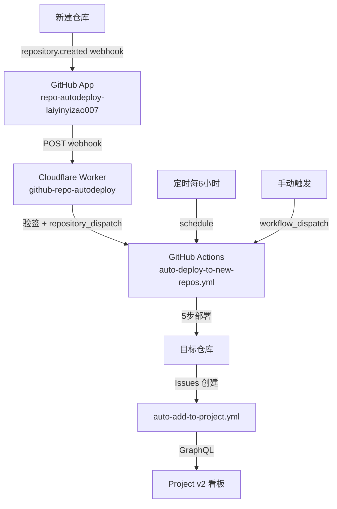
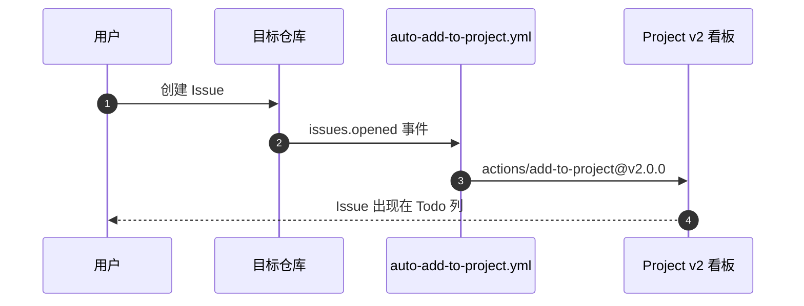
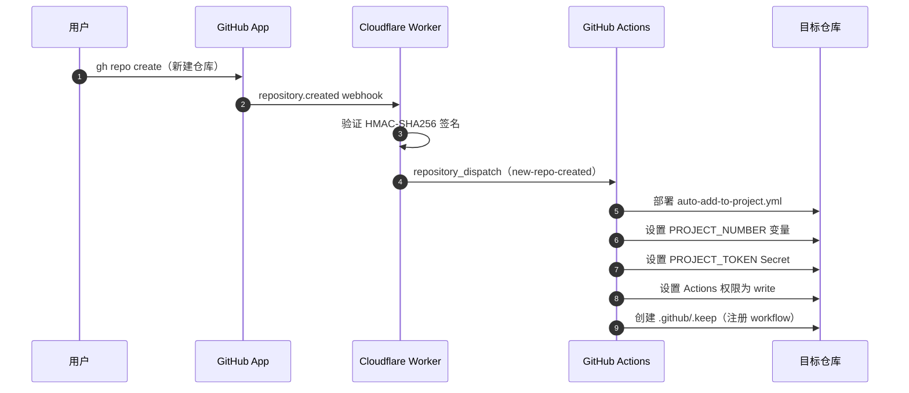
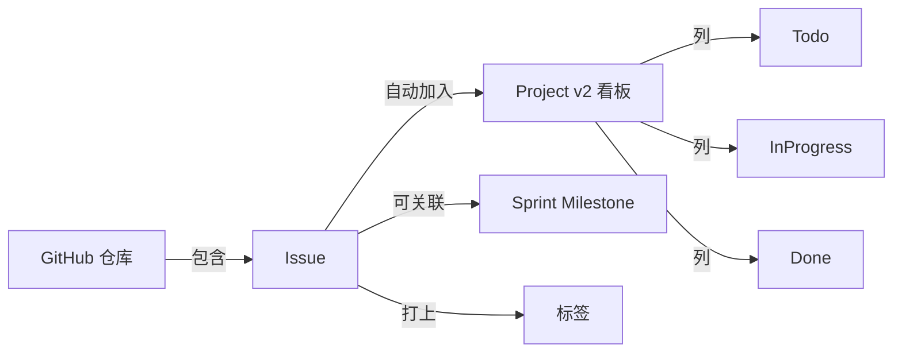

# PROJECTWIKI.md

## 1. 项目概述

- **目标**：基于 GitHub Issues 构建个人任务管理系统，实现 Issue 自动入 Project 看板、周计划自动创建、Sprint Milestone 自动生成，以及新仓库的全自动化接入。
- **背景**：个人账号无法使用 Organization 级功能，通过 GitHub App + Cloudflare Worker + GitHub Actions 三层架构实现等效的全自动化。
- **范围**：个人 GitHub 账号（`laiyinyizao007`）下的所有私有/公开仓库。
- **运行环境**：GitHub Actions（ubuntu-latest）、Cloudflare Workers（免费套餐）。

---

## 2. 架构设计

### 总体架构

### Issue 自动入看板流程

### 新仓库自动接入流程

---

## 3. 架构决策记录（ADR）

### ADR-001：使用 PAT 而非 GITHUB_TOKEN 操作 Project v2

- **背景**：私有仓库的 `GITHUB_TOKEN` 默认无 `projects: write` 权限，调用 Project v2 GraphQL API 时返回 403。
- **决策**：使用 classic PAT（`repo + project` scope）作为 `PROJECT_TOKEN` Secret。
- **影响**：每个目标仓库都需要存储该 Secret，通过自动化脚本/workflow 传播。

### ADR-002：GitHub App + Cloudflare Worker 实现实时新仓库感知

- **背景**：个人账号无组织级 webhook，无法在账号层面监听 `repository.created` 事件。
- **决策**：注册 GitHub App 订阅 `Repositories` 事件，webhook 指向 Cloudflare Worker，Worker 触发 `repository_dispatch`。
- **替代方案**：定时扫描（每 6 小时，已作为兜底保留）。
- **影响**：新仓库创建后实时（秒级）自动完成接入，无需人工操作。

### ADR-003：Worker 只做中继，部署逻辑保留在 GitHub Actions

- **背景**：Cloudflare Workers 不原生支持 libsodium，无法直接加密 GitHub Secrets；且 `gh` CLI 已封装所有复杂操作。
- **决策**：Worker 仅负责 webhook 验签 + 触发 `repository_dispatch`，实际部署由 GitHub Actions 完成。
- **影响**：架构更清晰，维护成本低。

---

## 4. 设计决策 & 技术债务

| 项目 | 说明 | 优先级 |
|------|------|--------|
| PAT 轮换 | PROJECT_TOKEN 过期后需手动更新各仓库 Secret | 低 |
| Worker 错误告警 | 当前 Worker 失败仅记录日志，无通知机制 | 低 |
| 多 Project 支持 | 目前 PROJECT_NUMBER 默认为 1，不支持多看板（可通过参数覆盖） | 低 |
| deploy 排除列表 | 管理仓库专用 workflow 需手动加入两处排除列表（yaml + PS 脚本）；新增可部署 workflow 无需修改任何列表 | 低 |

---

## 5. 模块文档

### 5.1 auto-add-to-project.yml

- **路径**：`.github/workflows/auto-add-to-project.yml`
- **触发**：`issues: [opened, reopened, transferred]`、`workflow_dispatch`
- **功能**：将 Issue 自动加入 `PROJECT_NUMBER` 对应的 Project v2 看板
- **依赖**：`secrets.PROJECT_TOKEN`（PAT）、`vars.PROJECT_NUMBER`

### 5.2 auto-deploy-to-new-repos.yml

- **路径**：`.github/workflows/auto-deploy-to-new-repos.yml`
- **触发**：`repository_dispatch[new-repo-created]`、`schedule(每6小时)`、`workflow_dispatch`
- **功能**：向目标仓库完成 5 步部署（workflow + 变量 + Secret + 权限 + 注册）
- **WF 列表**：动态枚举源仓库 `.github/workflows/` 下所有文件，过滤排除列表（管理仓库专用项）；新增可部署 workflow 无需修改此文件
- **排除列表**：`auto-deploy-to-new-repos.yml`、`auto-create-sprint.yml`、`weekly-plan.yml`、`create-milestone.yml`、`sync-labels.yml`
- **依赖**：`secrets.PROJECT_TOKEN`（PAT，同时用于传播自身）

### 5.3 weekly-plan.yml

- **路径**：`.github/workflows/weekly-plan.yml`
- **触发**：每周一 UTC 01:00（北京时间 09:00）
- **功能**：自动创建 `[Weekly] YYYY-WXX` Issue，包含每日回顾模板

### 5.4 create-milestone.yml

- **路径**：`.github/workflows/create-milestone.yml`
- **触发**：每周一 UTC 01:00（与 weekly-plan.yml 同步）
- **功能**：自动创建 `Sprint YYYY-WXX` Milestone，due_on 设为当周周五

### 5.5 sync-labels.yml

- **路径**：`.github/workflows/sync-labels.yml`
- **触发**：push 到 main、`workflow_dispatch`
- **功能**：从 `.github/labels.yml` 同步标签到仓库

### 5.6 Cloudflare Worker

- **名称**：`github-repo-autodeploy`
- **URL**：`https://github-repo-autodeploy.lovablelife.workers.dev`
- **代码**：`cloudflare-worker/src/index.js`
- **Secrets**：`WEBHOOK_SECRET`、`PAT`、`SOURCE_REPO`
- **功能**：验证 GitHub App webhook 签名，触发 `repository_dispatch`

### 5.8 auto-set-project-fields.yml

- **路径**：`.github/workflows/auto-set-project-fields.yml`
- **触发**：`issues: [labeled]`
- **功能**：给 Issue 打标签时，自动同步 Project 字段值
- **映射关系**：
  - `priority: P0/P1/P2/P3` → Priority 字段
  - `task/bug/feature/research/epic` → Category 字段
  - `size: XS/S/M/L/XL` → Size 字段
  - `status: todo/in-progress/blocked/review/done` → Status 字段
- **依赖**：`secrets.PROJECT_TOKEN`、`vars.PROJECT_NUMBER`

### 5.9 setup-project-board.ps1

- **路径**：`scripts/setup-project-board.ps1`
- **用途**：一次性配置 Project v2 看板（字段 + 视图），通过 GraphQL API 执行
- **用法**：`pwsh scripts/setup-project-board.ps1`
- **创建内容**：Priority / Category / Size / Sprint 字段，Table / Sprint / By Project 视图

### 5.10 auto-create-sprint.yml

- **路径**：`.github/workflows/auto-create-sprint.yml`（仅管理仓库）
- **触发**：每周一 UTC 01:00（北京时间 09:00）、`workflow_dispatch`
- **功能**：自动创建本周 Sprint 迭代（格式 `Sprint YYYY-WNN`，与 Milestone 命名对齐），并将上一 Sprint 未关闭的 Issue 续期到新 Sprint
- **去重**：基于 `startDate` 判断，若本周已有迭代则跳过（幂等）
- **依赖**：`secrets.PROJECT_TOKEN`、`vars.PROJECT_NUMBER`

### 5.11 scripts/common.ps1

- **路径**：`scripts/common.ps1`
- **用途**：PowerShell 共享函数库，供其他脚本通过 `. "$PSScriptRoot/common.ps1"` 引入
- **提供**：
  - `Get-ProjectToken`：统一的 PAT 获取逻辑（优先读 `$env:GH_TOKEN`，否则安全提示输入）
  - `Remove-ProjectToken`：会话结束时清理临时环境变量
  - `Get-CurrentRepo`：动态获取当前仓库 `Owner`/`Name`/`Full`（消除硬编码）

### 5.7 install-to-repo.ps1

- **路径**：`scripts/install-to-repo.ps1`
- **用途**：手动将 workflow 部署到指定仓库（备用方案，正常由 Worker 自动触发）
- **用法**：`pwsh scripts/install-to-repo.ps1 -TargetRepo "owner/repo"`

---

## 6. API 手册

### GitHub Actions Secrets（每个目标仓库）

| Secret 名 | 说明 | 来源 |
|-----------|------|------|
| `PROJECT_TOKEN` | classic PAT，scope: `repo + project` | 自动传播（auto-deploy workflow） |

### GitHub Actions Variables（每个目标仓库）

| Variable 名 | 说明 | 默认值 |
|-------------|------|--------|
| `PROJECT_NUMBER` | Project v2 编号 | `1` |

### Project v2 自定义字段（由 setup-project-board.ps1 创建）

| 字段名 | 类型 | 选项 |
|--------|------|------|
| Priority | Single Select | 🔴 P0 / 🟠 P1 / 🟡 P2 / 🟢 P3 |
| Category | Single Select | task / bug / feature / research / epic |
| Size | Single Select | XS / S / M / L / XL |
| Sprint | Iteration | 1 周周期 |

### repository_dispatch 事件

| 字段 | 值 |
|------|-----|
| `event_type` | `new-repo-created` |
| `client_payload.repo` | 目标仓库全名，如 `laiyinyizao007/newrepo` |

---

## 7. 数据模型

---

## 8. 核心流程

### 周计划流程

每周一自动触发：
1. `create-milestone.yml` → 创建 `Sprint YYYY-WXX` Milestone
2. `weekly-plan.yml` → 创建 `[Weekly] YYYY-WXX` Issue（含每日回顾模板）
3. `auto-add-to-project.yml` → 将 Issue 自动加入看板

### 新仓库接入流程（实时）

1. 用户创建新仓库
2. GitHub App 发送 webhook → Cloudflare Worker
3. Worker 验签后触发 `repository_dispatch`
4. `auto-deploy-to-new-repos.yml` 完成 5 步部署
5. 新仓库具备完整 Issue 追踪能力

### 每周规划工作流（多项目管理）

**核心原则**：Sprint 字段 = 本周工作队列，未分配 Sprint 的 Issue 视为 backlog。

| 时间 | 视图 | 操作 |
|------|------|------|
| 每周一（5分钟） | Table | 按 Priority 排序，把 P0/P1 Issue 分配到当前 Sprint |
| 每天 | Sprint | 只看当前 Sprint 的 Issue，决定今天做什么 |
| 专注某项目时 | By Project | 按 Repository 分组，查看该仓库所有 Issue |
| 随时 | Board | 拖动 Issue 更新 Status 状态 |

Todo 列堆积大量未规划 Issue 是正常的（backlog），不影响当前工作聚焦。

---

## 9. 依赖图谱

| 组件 | 版本/来源 | 用途 |
|------|-----------|------|
| `actions/add-to-project` | `v2.0.0` | Issue 加入 Project v2 |
| `actions/github-script` | `v7` | 调用 GitHub REST API |
| `EndBug/label-sync` | `v2` | 同步标签 |
| Cloudflare Workers | 免费套餐 | webhook 中继 |
| wrangler | `4.58.0` | Worker 部署工具 |

---

## 10. 维护建议

- **PAT 过期**：PAT 失效后，在 `my-project-management` 更新 `PROJECT_TOKEN` Secret，然后手动触发 `auto-deploy-to-new-repos.yml`（扫描全仓库）重新传播。
- **Worker 更新**：修改 `cloudflare-worker/src/index.js` 后在 `cloudflare-worker/` 目录运行 `npx wrangler deploy`。
- **新增仓库手动接入**：`pwsh scripts/install-to-repo.ps1 -TargetRepo "laiyinyizao007/repo"`。
- **定时扫描**：每 6 小时自动运行，可在 Actions 页面手动触发做即时全量检查。

---

## 11. 术语表

| 术语 | 说明 |
|------|------|
| PAT | Personal Access Token，GitHub 个人访问令牌 |
| Project v2 | GitHub Projects 第二代，基于 GraphQL |
| repository_dispatch | GitHub Actions 自定义事件触发机制 |
| Sealed Box | libsodium 非对称加密方式，GitHub Secrets 加密标准 |
| Worker | Cloudflare Workers，边缘计算无服务器函数 |

---

## 12. 变更日志

参见 `CHANGELOG.md`。
