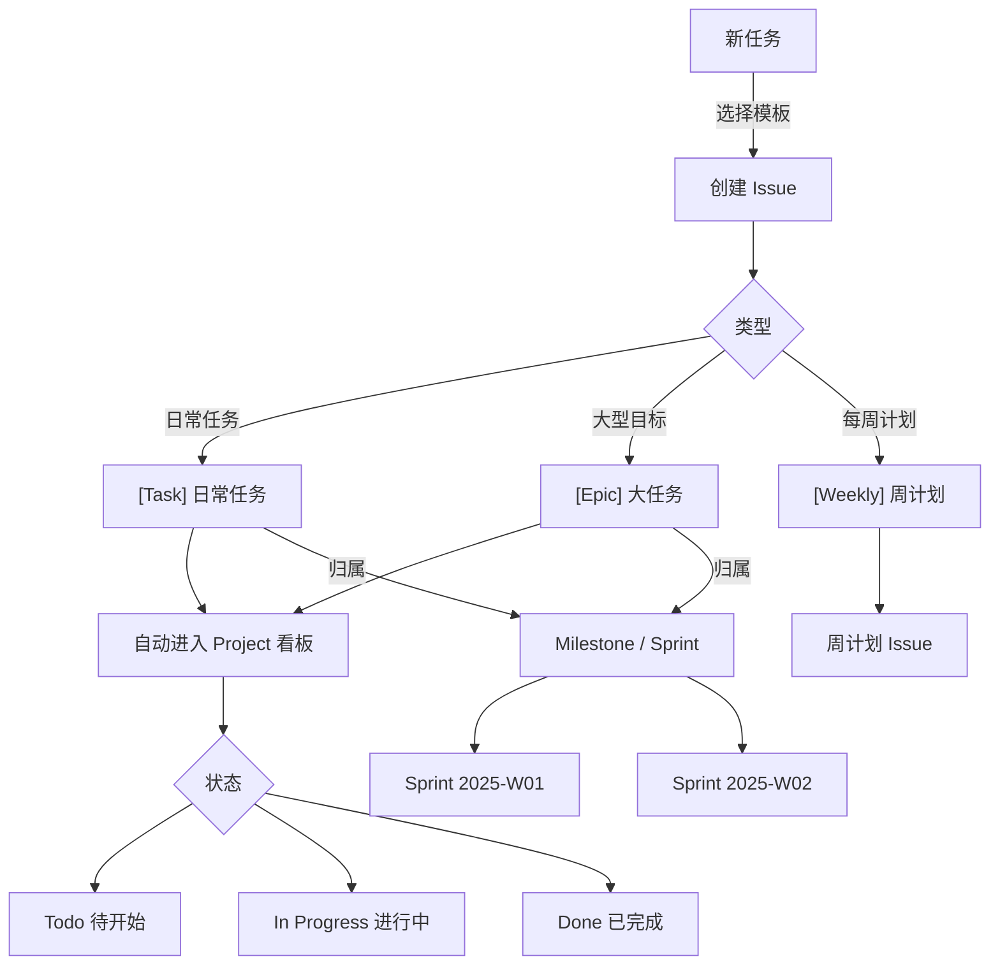

# 个人任务管理系统（基于 GitHub Issues + Projects）

用 GitHub 原生功能替代 Notion / Jira，无需第三方工具，开箱即用。

## 系统架构



## 首次设置

### 1. 推送到 GitHub

```bash
# 在 projectmanagement 目录下
git init
git add .
git commit -m "feat: 初始化 GitHub Issues 任务管理系统"

# 使用 GitHub CLI 创建仓库并推送（推荐）
gh repo create my-tasks --private --source=. --push

# 或使用 HTTPS
git remote add origin https://github.com/<你的用户名>/my-tasks.git
git push -u origin main
```

### 2. 同步标签

推送后，标签会通过 GitHub Actions 自动同步（触发条件：main 分支 `.github/labels.yml` 变更）。

也可手动触发：
- 进入仓库 → **Actions** → **Sync repository labels** → **Run workflow**

> 首次推送时建议手动触发一次，确保 25 个标签全部创建。

### 3. 创建 GitHub Project 看板

1. 进入仓库页面 → **Projects** 标签 → **New project**
2. 选择模板 **Board**（看板视图）
3. 命名为 `任务看板` 或 `My Tasks`
4. 点击 **Create**

**开启自动化（关键步骤）：**

1. 进入 Project → 点击右上角 **⋯** → **Workflows**
2. 找到 **"Auto-add to project"** → 开启，设置过滤条件（如仓库名）
3. 找到 **"Item closed"** → 开启，设置状态改为 **Done**

这样新建 Issue 会自动出现在 Todo 列，关闭 Issue 会自动移到 Done 列。

### 4. 创建第一个 Sprint（Milestone）

```bash
# 使用 GitHub CLI 创建 Milestone
gh api repos/<用户名>/<仓库名>/milestones \
  --method POST \
  --field title="Sprint 2025-W01" \
  --field due_on="2025-01-05T23:59:59Z" \
  --field description="第一周 Sprint"
```

或在仓库 → **Issues** → **Milestones** → **New milestone** 手动创建。

---

## 日常工作节奏

### 早晨（10 分钟）

1. 查看本周计划 Issue（`[Weekly]` 标签）
2. 确认今日任务优先级，为任务打上 `status: in-progress`
3. 把当日任务移到看板 **In Progress** 列

### 执行中

- 任务有进展时，在 Issue 评论区更新进度
- 遇到阻塞，打上 `status: blocked` 标签，并在评论中说明原因
- 子任务完成后勾选 Checklist

### 晚间（5 分钟）

- 完成的任务：关闭 Issue（自动移到 Done）
- 未完成的任务：更新进度评论，保持 `status: in-progress`
- 回顾本周计划 Issue 的完成率

---

## Issue 模板说明

| 模板 | 用途 | 标题前缀 |
|------|------|---------|
| **日常任务** | 一项具体工作，有明确的完成标准 | `[Task] ` |
| **大任务 (Epic)** | 需要拆分为多个子 Issue 的大型目标 | `[Epic] ` |
| **周计划** | 每周工作计划，每周一自动创建 | `[Weekly] ` |

---

## 标签体系

| 维度 | 标签 | 说明 |
|------|------|------|
| **类型** | `task` `epic` `bug` `feature` `research` `type: weekly-plan` | 任务性质 |
| **状态** | `status: todo` `status: in-progress` `status: blocked` `status: review` `status: done` | 当前进展 |
| **优先级** | `priority: P0` `priority: P1` `priority: P2` `priority: P3` | 紧急程度 |
| **领域** | `area: frontend` `area: backend` `area: docs` `area: ops` | 工作方向 |
| **工作量** | `size: XS` `size: S` `size: M` `size: L` `size: XL` | 时间估算 |

**优先级参考：**
- `P0` 今天必须完成
- `P1` 本周完成
- `P2` 本月完成
- `P3` 有空再做

**工作量参考：**
- `XS` < 1 小时
- `S` 1–4 小时
- `M` 半天到 1 天
- `L` 2–3 天
- `XL` > 3 天（建议拆分为子任务）

---

## Milestone（Sprint）命名规范

格式：`Sprint YYYY-WXX`

示例：
- `Sprint 2025-W01`（2025 年第 1 周）
- `Sprint 2025-W02`（2025 年第 2 周）

每个 Sprint 建议设置截止日期为当周周五。

---

## GitHub Actions 自动化

| 工作流 | 触发条件 | 功能 |
|--------|---------|------|
| **Create Weekly Plan Issue** | 每周一 09:00（北京时间），或手动触发 | 自动创建本周计划 Issue |
| **Sync repository labels** | 修改 `labels.yml` 推送到 main，或手动触发 | 同步标签配置 |

**手动触发工作流：**

仓库 → **Actions** → 选择工作流 → **Run workflow**

---

## 目录结构

```
.github/
├── ISSUE_TEMPLATE/
│   ├── config.yml          # 禁用空白 Issue，强制使用模板
│   ├── daily-task.yml      # 日常任务模板
│   ├── weekly-plan.yml     # 周计划模板（手动使用）
│   └── epic.yml            # 大任务模板
├── workflows/
│   ├── weekly-plan.yml     # 每周一自动创建周计划 Issue
│   └── sync-labels.yml     # 同步标签
└── labels.yml              # 标签定义（25 个）
README.md                   # 本文件
```
