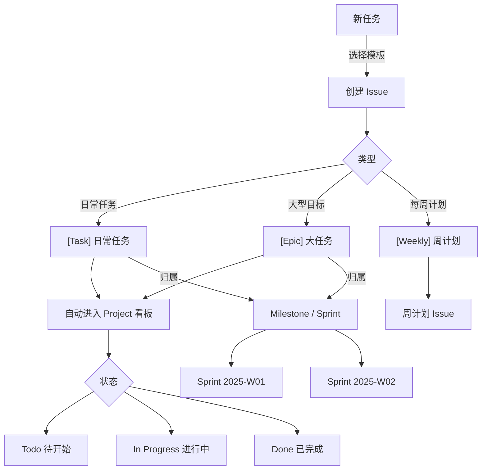

# 个人任务管理系统（基于 GitHub Issues + Projects）

用 GitHub 原生功能替代 Notion / Jira，无需第三方工具，开箱即用。

## 系统架构



## 首次设置

### 1. 推送到 GitHub

```bash
# 在 projectmanagement 目录下
git init
git add .
git commit -m "feat: 初始化 GitHub Issues 任务管理系统"

# 使用 GitHub CLI 创建仓库并推送（推荐）
gh repo create my-tasks --private --source=. --push

# 或使用 HTTPS
git remote add origin https://github.com/<你的用户名>/my-tasks.git
git push -u origin main
```

### 2. 同步标签

推送后，标签会通过 GitHub Actions **自动同步**（任何对 `main` 分支的推送都会触发，25 个标签全部创建）。

如需手动触发：仓库 → **Actions** → **Sync repository labels** → **Run workflow**。

### 3. 一键完成 Project + 首个 Sprint（自动化脚本）

在本地执行（需先 `gh auth login`）：

```powershell
pwsh scripts/setup.ps1
```

脚本会自动完成：
1. 创建 GitHub Project `任务看板`
2. 设置仓库变量 `PROJECT_NUMBER`（供 `add-to-project.yml` 读取）
3. 创建当周 Sprint Milestone（如 `Sprint 2026-W37`）

> 之后每周一会自动创建下周的 Milestone（`create-milestone.yml`）。
> 新建 Issue 时会自动加入 Project 看板（`add-to-project.yml`）。

### 4. 开启 Project 内置 Workflow（唯一手动操作）

1. 进入 Project `任务看板` → 右上角 **⋯** → **Workflows**
2. 找到 **"Item closed"** → 开启，设置状态改为 **Done**

这样关闭 Issue 时会自动移到 Done 列。

---

## 日常工作节奏

### 早晨（10 分钟）

1. 查看本周计划 Issue（`[Weekly]` 标签）
2. 确认今日任务优先级，为任务打上 `status: in-progress`
3. 把当日任务移到看板 **In Progress** 列

### 执行中

- 任务有进展时，在 Issue 评论区更新进度
- 遇到阻塞，打上 `status: blocked` 标签，并在评论中说明原因
- 子任务完成后勾选 Checklist

### 晚间（5 分钟）

- 完成的任务：关闭 Issue（自动移到 Done）
- 未完成的任务：更新进度评论，保持 `status: in-progress`
- 回顾本周计划 Issue 的完成率

---

## Issue 模板说明

| 模板 | 用途 | 标题前缀 |
|------|------|---------|
| **日常任务** | 一项具体工作，有明确的完成标准 | `[Task] ` |
| **大任务 (Epic)** | 需要拆分为多个子 Issue 的大型目标 | `[Epic] ` |
| **周计划** | 每周工作计划，每周一自动创建 | `[Weekly] ` |

---

## 标签体系

| 维度 | 标签 | 说明 |
|------|------|------|
| **类型** | `task` `epic` `bug` `feature` `research` `type: weekly-plan` | 任务性质 |
| **状态** | `status: todo` `status: in-progress` `status: blocked` `status: review` `status: done` | 当前进展 |
| **优先级** | `priority: P0` `priority: P1` `priority: P2` `priority: P3` | 紧急程度 |
| **领域** | `area: frontend` `area: backend` `area: docs` `area: ops` | 工作方向 |
| **工作量** | `size: XS` `size: S` `size: M` `size: L` `size: XL` | 时间估算 |

**优先级参考：**
- `P0` 今天必须完成
- `P1` 本周完成
- `P2` 本月完成
- `P3` 有空再做

**工作量参考：**
- `XS` < 1 小时
- `S` 1–4 小时
- `M` 半天到 1 天
- `L` 2–3 天
- `XL` > 3 天（建议拆分为子任务）

---

## Milestone（Sprint）命名规范

格式：`Sprint YYYY-WXX`

示例：
- `Sprint 2025-W01`（2025 年第 1 周）
- `Sprint 2025-W02`（2025 年第 2 周）

每个 Sprint 建议设置截止日期为当周周五。

---

## GitHub Actions 自动化

| 工作流 | 触发条件 | 功能 |
|--------|---------|------|
| **Create Weekly Plan Issue** | 每周一 09:00（北京时间），手动触发 | 自动创建本周计划 Issue |
| **Create Weekly Sprint Milestone** | 每周一 09:00（北京时间），手动触发 | 自动创建当周 Sprint Milestone |
| **Auto Create Sprint** | 每周一 09:00（北京时间），手动触发 | 在 Project 内创建迭代 + 续期未完成任务 |
| **Sync repository labels** | 推送到 main，手动触发 | 同步标签配置（25 个） |
| **Add Issue to Project** | 新 Issue 创建/重开/转移时 | 自动加入 GitHub Project 看板 |
| **Set Project Fields from Labels** | Issue 打标签时 | 自动同步 Priority/Category/Size/Status 到看板字段 |
| **Issue Closed → Done** | Issue 关闭时 | 自动将看板状态设为 Done |
| **Detect Duplicate Issues** | 新 Issue 创建时 | 检测重复 Issue，相似度 ≥ 0.6 时评论提示 |
| **Generate Issue Task List** | 新 Issue 创建时 | 根据标题前缀（feat/fix/docs 等）自动生成任务清单 |
| **Claude Issue Handler** | Issue/评论含 `@claude` 时（仅 Owner） | Claude AI 自动响应，可读写代码、创建 PR |
| **Auto-deploy to New Repos** | 推送改动 workflow/scripts、新建仓库、每 6 小时 | 将 workflow 和脚本部署到所有仓库 |
| **Daily Review** | 工作日 21:30（北京时间），手动触发 | 当日 commit AI 摘要 + 自动关闭已完成 Issue（v1.18 prompt 加固、活跃分母、schedule 容差） |
| **Weekly Progress Update** | 每周日 09:00（北京时间），手动触发 | 仓库分析 + AI 周报 + GitHub Profile 同步 |

**手动触发工作流：**

仓库 → **Actions** → 选择工作流 → **Run workflow**

---

## 周报系统

每周日 09:00（北京时间）自动运行，也可在 Actions 中手动触发。

### 脚本说明

| 脚本 | 功能 |
|------|------|
| `repo_analyzer.py` | 获取全量仓库，评分排序，更新 `tracked_config.json` 和 `repo_database.md` |
| `update_profile.py` | 读取 `tracked_config.json`，更新 `profile.md` 的 GITHUB_PROJECTS 区块 |
| `weekly_report.py` | 读取各追踪仓库的近期提交，用 Claude AI 生成周报，写入 `weekly-reports/` |

### 本地运行

```bash
# 需要 gh auth login 和 ANTHROPIC_API_KEY 环境变量
python3 repo_analyzer.py --skip-readme-gen   # 仅分析，跳过 README 草稿
python3 update_profile.py --no-push          # 更新 profile.md，不同步到 GitHub
python3 weekly_report.py --no-push           # 生成周报，不推送
python3 weekly_report.py --dry-run           # 预览模式，不写文件
```

### 配置文件

- `tracked_config.json` — 追踪仓库列表，支持自动发现（质量分 ≥ 40 自动加入）
- `profile.md` — GitHub Profile README 模板（含 WEEKLY_PROGRESS、GITHUB_PROJECTS、GITHUB_STATS 区块）

### 必需 Secrets

| Secret | 说明 |
|--------|------|
| `ANTHROPIC_API_KEY` | Claude API 密钥（已有） |
| `PROFILE_SYNC_TOKEN` | 用于写 `laiyinyizao007/laiyinyizao007` profile README 的 PAT |

---

## 目录结构

```
.github/
├── ISSUE_TEMPLATE/
│   ├── config.yml          # 禁用空白 Issue，强制使用模板
│   ├── daily-task.yml      # 日常任务模板
│   ├── weekly-plan.yml     # 周计划模板（手动使用）
│   └── epic.yml            # 大任务模板
├── workflows/
│   ├── weekly-plan.yml     # 每周一自动创建周计划 Issue
│   ├── sync-labels.yml     # 同步标签
│   └── weekly-update.yml   # 每周日：仓库分析 + 周报 + Profile 同步
└── labels.yml              # 标签定义（25 个）
weekly_report.py            # AI 周报生成脚本
update_profile.py           # GitHub Profile 更新脚本
repo_analyzer.py            # 仓库全量分析脚本
tracked_config.json         # 追踪仓库配置
profile.md                  # GitHub Profile README
weekly-reports/             # 历史周报存档
projects/                   # 项目详情文件
README.md                   # 本文件
```
