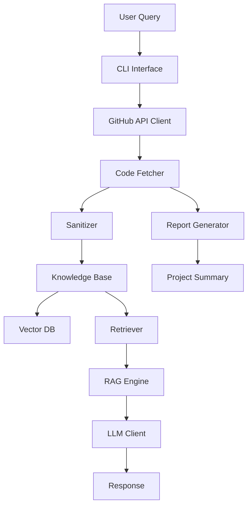

# GitHub Agent RAG System

An AI-powered agent that analyzes GitHub private repositories, automatically sanitizes sensitive information, and provides RAG-based Q&A capabilities for technical recruitment and project evaluation.

## Features

- **Private Repository Access**: Read code directly from GitHub private repos via API
- **Privacy Protection**: Automatic detection and sanitization of sensitive data (API keys, passwords, tokens, emails)
- **RAG Q&A**: Ask natural language questions about the codebase
- **Project Analysis**: Automatic technology stack detection and architecture analysis
- **Report Generation**: Generate comprehensive project summaries

## Quick Start

### 1. Installation

```bash
# Clone the repository
git clone <repo-url>
cd mygithubprojectagent

# Create virtual environment
python -m venv venv
source venv/bin/activate  # On Windows: venv\Scripts\activate

# Install dependencies
pip install -r requirements.txt
```

### 2. Configuration

```bash
# Copy example environment file
cp .env.example .env

# Edit .env and add your credentials
# - GITHUB_TOKEN: GitHub personal access token
# - OPENAI_API_KEY: OpenAI API key (or ANTHROPIC_API_KEY)
```

### 3. Usage

```bash
# Analyze a repository
python -m src.main analyze owner/repo-name

# Start interactive chat
python -m src.main chat

# Ask a single question
python -m src.main ask "What is the main entry point?"

# Generate a report
python -m src.main report --output report.md

# Check knowledge base status
python -m src.main status
```

## Configuration Options

### Environment Variables

| Variable | Description | Required |
|----------|-------------|----------|
| `GITHUB_TOKEN` | GitHub personal access token | Yes |
| `OPENAI_API_KEY` | OpenAI API key | Yes* |
| `ANTHROPIC_API_KEY` | Anthropic API key (alternative) | Yes* |
| `EMBEDDING_PROVIDER` | `openai` or `sentence-transformers` | No (default: sentence-transformers) |
| `EMBEDDING_MODEL` | Model name for embeddings | No |
| `CHROMA_DB_PATH` | Path to ChromaDB storage | No |

*Either OpenAI or Anthropic key is required.

### GitHub Token Setup

1. Go to https://github.com/settings/tokens
2. Generate a new token with `repo` scope
3. Copy the token to your `.env` file

## Architecture



## Project Structure

```
mygithubprojectagent/
├── src/
│   ├── config.py           # Configuration management
│   ├── github_client.py    # GitHub API wrapper
│   ├── repo_analyzer.py    # Code analysis
│   ├── chunker.py          # Document chunking
│   ├── embedder.py         # Embedding models
│   ├── knowledge_base.py   # Vector DB management
│   ├── retriever.py        # Search/retrieval
│   ├── rag_engine.py       # RAG pipeline
│   ├── llm_client.py       # LLM integration
│   ├── sanitizer.py        # Privacy protection
│   ├── patterns.py         # Sensitive data patterns
│   ├── report_generator.py # Report generation
│   ├── cli.py              # CLI interface
│   └── main.py             # Entry point
├── tests/                  # Test files
├── docs/                   # Documentation
├── .env.example            # Example configuration
├── pyproject.toml          # Project metadata
├── requirements.txt        # Dependencies
└── README.md              # This file
```

## Privacy and Security

### Sensitive Information Detection

The system automatically detects and sanitizes:

- API Keys (AWS, GitHub, OpenAI, etc.)
- Passwords and secrets
- Authentication tokens
- Private keys
- Database connection strings
- Email addresses (partial masking)

### Sanitization Methods

- **Mask**: Replace with `***REDACTED***`
- **Hash**: Replace with hashed identifier
- **Remove**: Delete completely

Configure via `REDACTION_STYLE` environment variable.

## Development

### Running Tests

```bash
pytest tests/
```

### Code Formatting

```bash
black src/
isort src/
```

### Type Checking

```bash
mypy src/
```

## License

MIT License
