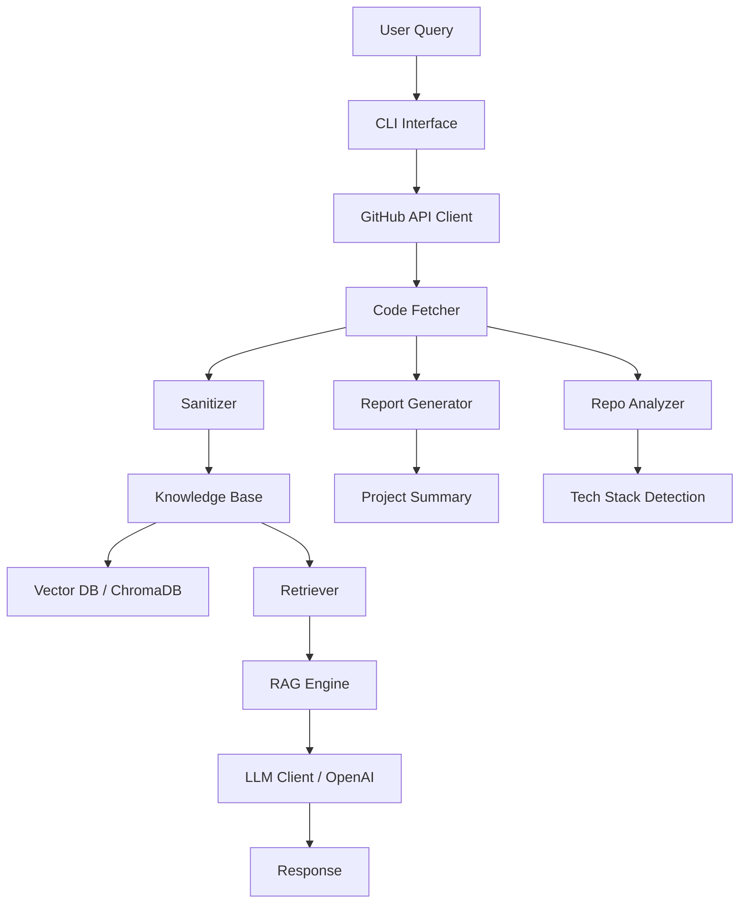
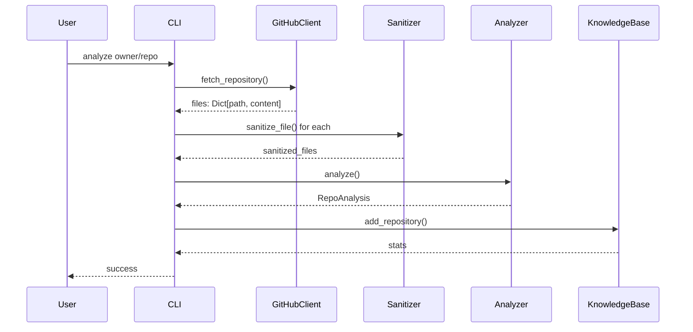
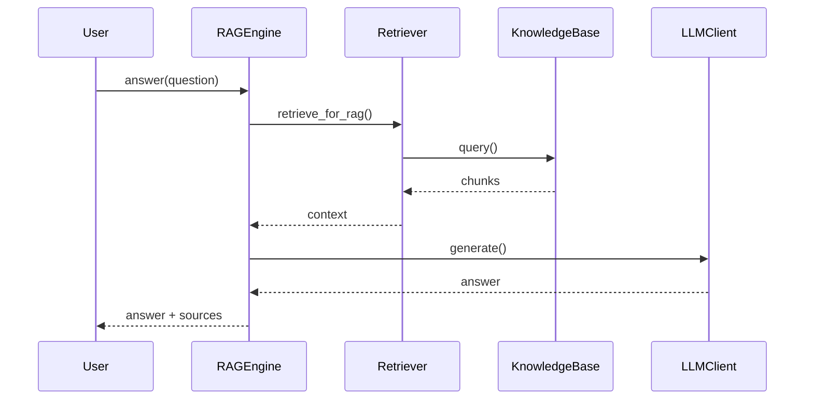

# PROJECTWIKI.md

## 1. 项目概述

**名称**: GitHub Agent RAG System

**目标**: 构建一个 Agent RAG 系统，能够直接分析 GitHub 私有仓库代码（无需克隆），智能脱敏敏感信息后，向招聘者提供准确的项目介绍和问答服务。

**背景**: 在技术人员招聘过程中，了解候选人的开源项目或私有代码仓库是一个重要环节。然而，直接分享私有仓库可能暴露敏感信息。本系统通过 GitHub API 读取代码，自动脱敏敏感信息，并提供基于 RAG 的智能问答能力。

**范围**:
- ✅ 通过 GitHub API 读取私有仓库文件结构和代码内容
- ✅ 智能识别并脱敏敏感信息（API keys, passwords, tokens, 个人邮箱等）
- ✅ 构建代码知识库（文件结构、依赖关系、核心功能）
- ✅ 基于 RAG 的问答能力
- ✅ 生成项目介绍摘要
- ✅ 命令行交互界面

**非目标**:
- ❌ Web 界面（MVP 阶段）
- ❌ 多仓库同时分析
- ❌ 实时同步更新
- ❌ 用户认证系统

## 2. 架构设计



### 模块职责

| 模块 | 职责 | 入口点 | 依赖 |
|------|------|--------|------|
| `github_client.py` | GitHub API 调用、仓库获取 | `GitHubClient.fetch_repository()` | PyGithub |
| `sanitizer.py` | 敏感信息脱敏 | `Sanitizer.sanitize()` | patterns.py |
| `repo_analyzer.py` | 代码结构分析 | `RepoAnalyzer.analyze()` | ast |
| `chunker.py` | 文档分块 | `CodeChunker.chunk_repository()` | - |
| `embedder.py` | 文本向量化 | `Embedder.embed()` | sentence-transformers/openai |
| `knowledge_base.py` | 向量知识库管理 | `KnowledgeBase.add_repository()` | chromadb |
| `retriever.py` | 相似度检索 | `Retriever.retrieve()` | knowledge_base |
| `rag_engine.py` | RAG 问答引擎 | `RAGEngine.answer()` | llm_client, retriever |
| `llm_client.py` | LLM 调用封装 | `LLMClient.generate()` | openai/anthropic |
| `report_generator.py` | 报告生成 | `ReportGenerator.generate_report()` | - |
| `cli.py` | 命令行界面 | `cli()` | click, rich |

## 3. 架构决策记录（ADR）

### ADR-001: 向量数据库选择 ChromaDB

**日期**: 2026-03-06

**状态**: 已接受

**背景**: 需要选择一个向量数据库来存储代码块的嵌入向量。

**考虑选项**:
- ChromaDB: 本地优先，零配置，轻量级
- Pinecone: 云端托管，高性能，有成本
- FAISS: 纯本地，高性能，需要手动管理

**决策**: 使用 ChromaDB

**理由**:
1. 零配置即可使用，适合 MVP
2. 本地存储，无额外成本
3. 支持持久化，重启后数据保留
4. 与 Python 生态集成良好

**影响**:
- 单实例部署，不支持分布式
- 大数据量时可能需要迁移

### ADR-002: 嵌入模型选择 sentence-transformers

**日期**: 2026-03-06

**状态**: 已接受

**背景**: 需要选择文本嵌入模型将代码转换为向量。

**考虑选项**:
- OpenAI text-embedding-3-small: 高质量，有 API 成本
- sentence-transformers (all-MiniLM-L6-v2): 本地运行，免费，质量良好

**决策**: 默认使用 sentence-transformers，支持切换到 OpenAI

**理由**:
1. 本地运行，无 API 调用成本
2. 模型较小（~80MB），加载快速
3. 代码嵌入质量足够
4. 提供备选方案（OpenAI）以满足不同需求

### ADR-003: 脱敏策略使用正则表达式

**日期**: 2026-03-06

**状态**: 已接受

**背景**: 需要检测和脱敏代码中的敏感信息。

**考虑选项**:
- 正则表达式: 简单，快速，易于维护
- 机器学习模型: 准确率高，但需要训练数据
- 混合方案: 正则 + 简单的 ML

**决策**: 使用正则表达式规则库

**理由**:
1. 敏感信息模式相对固定（API key、密码等）
2. 正则表达式足够覆盖 95%+ 的情况
3. 性能高，不增加额外依赖
4. 易于扩展新规则

## 4. 设计决策 & 技术债务

### 当前技术债务

| 项目 | 优先级 | 描述 | 计划解决时间 |
|------|--------|------|-------------|
| 无状态设计 | 低 | 当前每次分析都需要重新获取仓库 | 未来支持增量更新 |
| 单线程 | 中 | 仓库获取是同步的，大量文件时较慢 | 未来使用异步 |
| 文件大小限制 | 中 | 默认 5MB 限制，可能漏掉大文件 | 未来可配置 |

### 设计决策

1. **脱敏先于向量化**: 敏感信息在存入知识库前就被脱敏，确保向量数据库中无敏感数据
2. **文件级缓存**: GitHub API 响应可以本地缓存，减少重复请求
3. **模块化设计**: 每个组件（GitHub、Sanitizer、RAG）独立，便于测试和替换

## 5. 模块文档

### GitHubClient

职责：封装 GitHub API，提供仓库获取功能。

入口点：
- `fetch_repository()` - 获取完整仓库文件
- `get_file_tree()` - 获取文件树
- `get_file_content()` - 获取单个文件内容

关键类型：
- `GitHubConfig` - 配置类

外部依赖：PyGithub

### Sanitizer

职责：识别并脱敏敏感信息。

入口点：
- `sanitize()` - 对文本进行脱敏
- `sanitize_file()` - 对文件进行脱敏（支持特殊处理）

关键类型：
- `PrivacyConfig` - 隐私配置
- `SensitivePattern` - 敏感模式定义

风险：可能存在漏检，建议配合人工审核

### RAGEngine

职责：RAG 问答引擎，协调检索和生成。

入口点：
- `answer()` - 回答问题
- `chat()` - 多轮对话
- `explain_code()` - 代码解释

关键类型：
- `LLMClient` - LLM 调用接口

风险：答案质量取决于检索结果和 LLM 能力

## 6. API 手册

### 命令行接口

```bash
# 分析仓库
python -m src.main analyze <owner/repo> [--ref <branch>]

# 交互式问答
python -m src.main chat

# 单条问答
python -m src.main ask "<question>"

# 生成报告
python -m src.main report [--output <file>]

# 查看状态
python -m src.main status
```

### Python API

```python
from src.config import load_config
from src.cli import GitHubAgent

config = load_config()
agent = GitHubAgent(config)

# 分析仓库
result = agent.analyze_repo("owner/repo")

# 提问
answer = agent.ask("What does this project do?")

# 生成报告
report = agent.generate_report()
```

## 7. 数据模型

### Repository Analysis

```python
@dataclass
class RepoAnalysis:
    total_files: int
    total_lines: int
    tech_stack: TechStack
    entry_points: List[str]
    core_modules: List[str]
    file_analyses: Dict[str, FileInfo]
```

### File Info

```python
@dataclass
class FileInfo:
    path: str
    content: str
    language: Optional[str]
    size: int
    is_entry_point: bool
    imports: List[str]
    functions: List[str]
    classes: List[str]
```

### Chunk

```python
@dataclass
class Chunk:
    content: str
    source_file: str
    chunk_type: str  # function, class, module, segment
    start_line: int
    end_line: int
    metadata: dict
```

## 8. 核心流程

### 仓库分析流程



### RAG 问答流程



## 9. 依赖图谱

### 直接依赖

| 包 | 版本 | 用途 | 许可证 |
|----|------|------|--------|
| PyGithub | >=2.1.1 | GitHub API 调用 | LGPL-3.0 |
| chromadb | >=0.4.0 | 向量数据库 | Apache-2.0 |
| sentence-transformers | >=2.2.0 | 本地嵌入模型 | Apache-2.0 |
| openai | >=1.0.0 | OpenAI API | MIT |
| click | >=8.0.0 | CLI 框架 | BSD-3-Clause |
| rich | >=13.0.0 | 终端美化 | MIT |
| python-dotenv | >=1.0.0 | 环境变量管理 | BSD-3-Clause |

### 间接依赖（主要）
- torch (via sentence-transformers)
- transformers (via sentence-transformers)
- numpy
- fastapi (via chromadb)

## 10. 维护建议

### 运维要点

1. **环境变量管理**: 确保 `.env` 文件不被提交到版本控制
2. **GitHub Token 轮换**: 定期更新 GitHub Personal Access Token
3. **磁盘空间**: ChromaDB 和缓存会占用磁盘，定期清理

### 监控

- 跟踪 GitHub API 限流情况
- 监控知识库大小
- 记录脱敏检测结果

### 容量规划

| 指标 | 当前 | 建议上限 | 扩展方案 |
|------|------|----------|----------|
| 单个仓库文件数 | 无限制 | 10,000 | 分批处理 |
| 向量数据库 | ChromaDB | 100万文档 | 迁移到 Pinecone |
| 嵌入维度 | 384 (MiniLM) | 1536 (OpenAI) | 可配置 |

## 11. 术语表和缩写

| 术语 | 全称 | 定义 |
|------|------|------|
| RAG | Retrieval-Augmented Generation | 检索增强生成，结合知识检索的 LLM 问答 |
| LLM | Large Language Model | 大语言模型 |
| Embeddings | - | 文本的向量表示 |
| Chunk | - | 文档分块后的片段 |
| Sanitization | - | 脱敏，去除敏感信息 |
| ADR | Architecture Decision Record | 架构决策记录 |
| PII | Personally Identifiable Information | 个人身份信息 |

## 12. 变更日志

参见 [CHANGELOG.md](../CHANGELOG.md)

## 13. 项目智慧库

### 关键实现路径

1. **添加新敏感模式**: 在 `src/patterns.py` 的对应列表中添加正则表达式
2. **添加新语言支持**: 在 `src/repo_analyzer.py` 的 `LANGUAGE_MAP` 中添加映射
3. **更换向量数据库**: 实现新的 `KnowledgeBase` 类，保持接口一致

### 已知挑战

- **GitHub API 限流**: 对于大仓库，可能需要处理 rate limit
- **二进制文件**: 当前会跳过无法解码的文件
- **代码复杂度**: AST 解析可能失败，需要 fallback 到正则

### 已知陷阱

- **脱敏不彻底**: 正则表达式无法覆盖所有情况，重要场景需人工审核
- **Token 过期**: GitHub Token 可能过期，需要友好的错误提示
- **内存占用**: 大仓库分析时可能内存不足

## 14. 错误知识库

### ERR-001: GitHub Token 无效

**签名**: `Failed to access repository: 401`

**根因**: GitHub Token 无效或过期

**解决方案**: 检查 `.env` 中的 `GITHUB_TOKEN`，重新生成并更新

**预防**:
- 启动时验证 Token 有效性
- 提供清晰的错误提示

### ERR-002: 仓库不存在或无权访问

**签名**: `Failed to access repository: 404`

**根因**: 仓库不存在，或 Token 没有 `repo` 权限

**解决方案**: 检查仓库名称格式（owner/repo），确认 Token 权限

### ERR-003: ChromaDB 初始化失败

**签名**: `sqlite3.OperationalError: unable to open database file`

**根因**: ChromaDB 目录权限问题或路径不存在

**解决方案**: 运行 `python -c "from src.config import load_config, ensure_directories; ensure_directories(load_config())"`

### 预防检查清单

- [ ] 检查 `.env` 文件是否存在且配置正确
- [ ] 确认 GitHub Token 有 `repo` 权限
- [ ] 确认 LLM API Key 有效
- [ ] 确保有足够的磁盘空间
- [ ] 确保有网络连接

## 15. 快速排障指南

| 报错特征 | 可能原因 | 快速检查 | 解决方案 |
|----------|----------|----------|----------|
| `GITHUB_TOKEN not set` | 环境变量未配置 | `cat .env` | 配置 GITHUB_TOKEN |
| `401 Bad credentials` | Token 无效 | GitHub Token 页面 | 重新生成 Token |
| `404 Not Found` | 仓库不存在或无权限 | `gh repo view owner/repo` | 检查仓库名称和权限 |
| `No module named 'chromadb'` | 依赖未安装 | `pip list | grep chroma` | `pip install -r requirements.txt` |
| `CUDA out of memory` | 嵌入模型 GPU 内存不足 | `nvidia-smi` | 使用 CPU 或更小的模型 |

### 环境问题排查脚本

```bash
#!/bin/bash
echo "=== GitHub Agent RAG 环境检查 ==="
echo ""
echo "1. Python 版本:"
python --version
echo ""
echo "2. 关键依赖:"
pip list | grep -E "(PyGithub|chromadb|openai|click|rich)"
echo ""
echo "3. 环境变量:"
if [ -f .env ]; then
    echo "✓ .env 文件存在"
    grep -q "GITHUB_TOKEN" .env && echo "✓ GITHUB_TOKEN 已配置" || echo "✗ GITHUB_TOKEN 未配置"
else
    echo "✗ .env 文件不存在"
fi
echo ""
echo "4. 目录结构:"
[ -d "chroma_db" ] && echo "✓ chroma_db 目录存在" || echo "✗ chroma_db 目录不存在"
[ -d "cache" ] && echo "✓ cache 目录存在" || echo "✗ cache 目录不存在"
```
